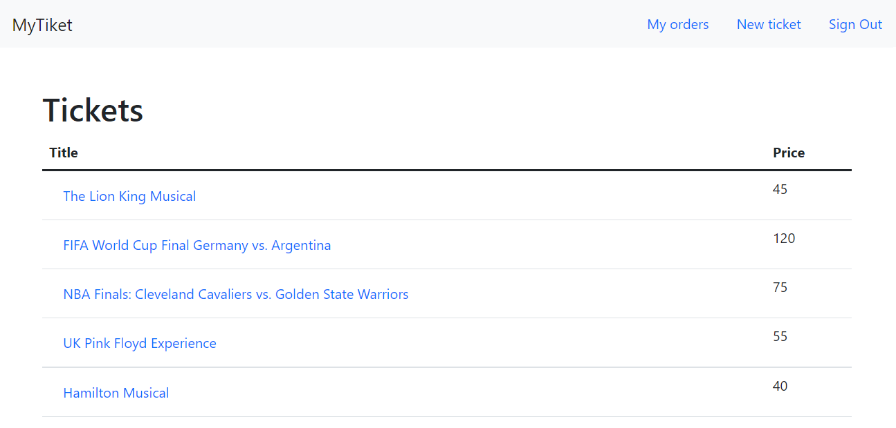
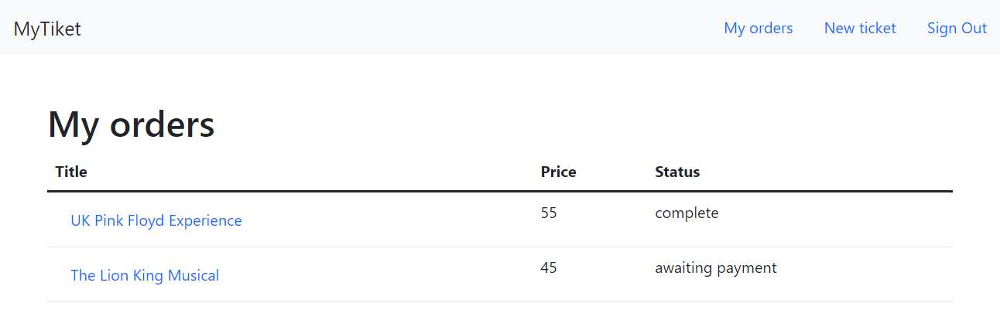
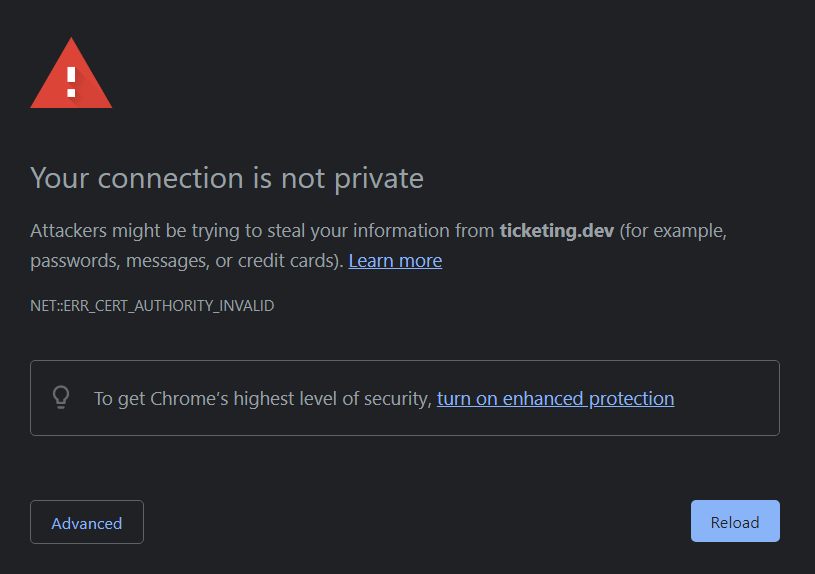

This microservices app was inspired by this course, taught by Stephen Grider.

This project has many things that can be continued, including:

- check out last video of the course.

Hi there, you microservices enthusiast! 🤠

This is a project that was developed using as reference the [Microservices with Node JS and React](https://www.udemy.com/course/microservices-with-node-js-and-react/) course, by [Stephen Grider](https://twitter.com/ste_grider).

It is a simple e-commerce app where you can create tickets that will be available for purchase.

Every purchased ticket will be available under "My orders".

When a ticket is reserved, it will be for 15 minutes available for the payment to be completed. During that time, it will have the status `awaiting payment`. Its status will update to `completed` as soon as the payment is completed, or `cancelled` if the time expires.

# Project architecture

- containers by [Docker](https://www.docker.com/)
- containers orchestration using [Kubernetes](https://kubernetes.io/)
  - ingress
- Kubernetes continuous development facilitated by [Skaffold](https://skaffold.dev/), which handles the workflow for building, pushing, and deploying the app
- NATS Streaming Server to establish a communication environment between microservices by means of subscription to events (messages)
- Nodejs on the backend side, using Expressjs to do the routing
- Mongodb to store the data
- Mongoose to facilitate the CRUD operations
- payments were developed using [Stripe](https://stripe.com/en-gb).
- Redis
- Testing using [Jest](https://jestjs.io/)
- the server was written using Typescript and the client Javascript

This project is comprised of 6 microservices:

| Microservice | Description                |
| ------------ | -------------------------- |
| Auth         | Handles the authentication |
| client       | Text                       |
| expiration   | Text                       |
| orders       | Text                       |
| payments     | Text                       |
| tickets      | Text                       |

It is a social network with the goal of connecting developers across the world by enabling them to:

- create their own profile
- visit other developer profiles
- add posts
- comment and like other developer posts

Some endpoints are private. That means that an authentication is required. JWT was used to accomplish this.

# How to get this project up and running

- ## Add secrets to the following pods:
  -
- Create the DNS to ticketing.dev by adding the following line to the
- run `skaffold dev` in the root directory
- Have fun!

# Notes

## NATS Streaming Server

- It was created, in each microservice, a file that exports a singleton of a class that allows not only the connection of the NATS streaming server but also the very client, which is returned when the connection is established, that will enable the creation of event listeners and publishers.

- A graceful shutdown was implemented in order to prevent the crushed client to stay open until the heart beat time is completed.

## Client

- When first connecting to the app, the following image may appear

If that's the case, put the mouse focus on the image and type `thisisunsafe`.

## Payment

- In order to test the application and create a successful payment use any of [these](https://stripe.com/docs/testing#cards) test card numbers when paying a ticket, a valid expiration date in the future, and any random CVC number.

## Define DNS

- In order to have the site accessible in a human readable domain, we must translate the IP address to e.g. `ticketing.dev`. To do so, we must define

## Environment variables

- Secrets...
